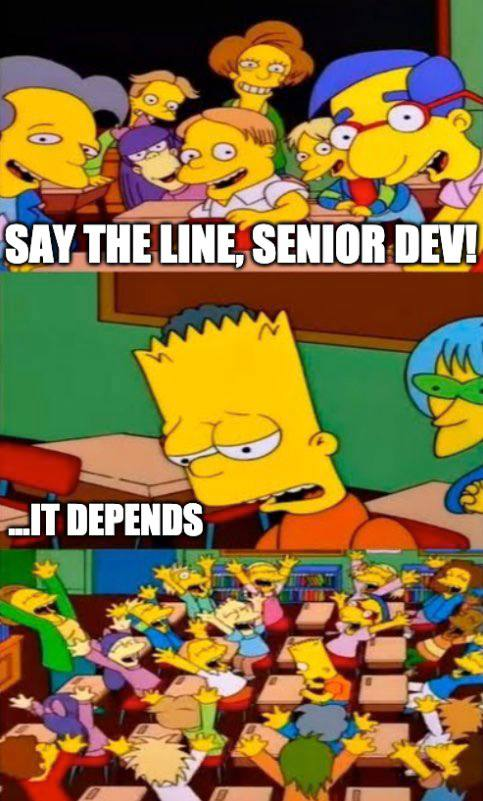
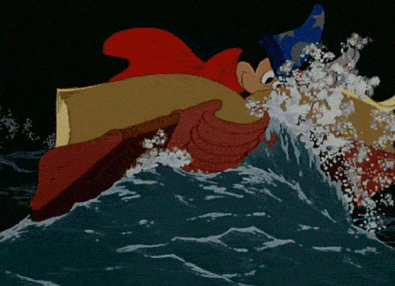

## Meme Gallery

Collection of memes I keep around for **cultural reference**.

#### Sources:

- Profunctor IO [Telegram channel](tg://resolve?domain=profunctor_io)
- DevOps reactions [Tumblr page](https://devopsreactions.tumblr.com)

------

		

		

  		

apis.jpg

		

		

  		

backend.jpg

		

		

  		

books.jpg

		

		

  		

bricks.jpg

		

		

  		

builds.jpg

		

		

  		

builds2.jpg

		

		

  		

cicd_tests.gif

		

		

  		

clouds.jpg

		

		

  		

clouds2.jpg

		

		

  		

controversy.jpg

		

		

  		

cpp.jpg

		

		

  		

data.jpg

		

		

  		

delegating.jpg

		

		

  		

delivering.jpg

		

		

  		

depends.jpg

		

		

  		

deploy.jpg

		

		

  		

difficulties_ru.jpg

		

		

  		

dry_run_ru.jpg

		

		

  		

email_culture.jpg

		

		

  		

email_culture2.jpg

		

		

  		

email_culture3.gif

		

		

  		

embedded_dbs.jpg

		

		

  		

engineering2.jpg

		

		

  		

engineering3.jpg

		

		

  		

engineering4.jpg

		

		

  		

engineering5.jpg

		

		

  		

fp.jpg

		

		

  		

fp2.jpg

		

		

  		

frontend.jpg

		

		

  		

frontend2.jpg

		

		

  		

ml.jpg

		

		

  		

old_projects.jpg

		

		

  		

passing_unit_tests.jpg

		

		

  		

postgres.jpg

		

		

  		

prs.jpg

		

		

  		

prs2.jpg

		

		

  		

python.jpg

		

		

  		

recording.jpg

		

		

  		

refactor.jpg

		

		

  		

regex.jpg

		

		

  		

releases_ru.jpg

		

		

  		

s3_use.jpg

		

		

  		

skill_issues.jpg

		

		

  		

solo_projects.jpg

		

		

  		

standups.jpg

		

		

  		

support_shifts.gif

		

		

  		

table_or_stream.jpg

		

		

  		

ts.jpg

		

		

  		

uml.jpg

